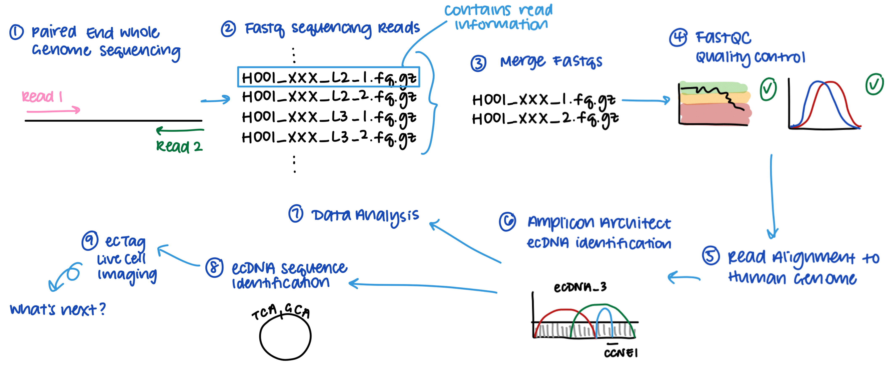

## Analyzing extrachromosomal circular DNA from ovarian cancer organoid whole genome sequencing.

### About
A collection of scripts from a summer internship with the Wennerberg Lab at the Biotech Research and Innovation Center in the University of Copenhagen. Thank you to David Fontaneda, Jeremy Ariey-Bonnet, Laure Gall-Mas, and Krister Wennerberg for the advice, support, and guidance throughout the summer.

### Project
The publication of [AmpliconArchitect](https://github.com/virajbdeshpande/AmpliconArchitect) fundamentally changed how extrachromosomal
DNA can be analyzed. Simultaneously, several labs have recently published more evidence about extrachromosomal, circular DNA (ecDNA) having a unique role or possible correlation with cancers. Over the summer, I researched the role of ecDNA in ovarian cancer in both a wet-lab and dry-lab capacity.

### Skills gained
Over the course of a short 10 weeks, I became skilled at using a Linux terminal, SSHing into a shared computer (Tycho), working with screens on terminals, and coding in Python, R, and bash. Importantly, I also sharpened my science communication skills through sharing my insights with the lab. Creating graphs (some of which are in *results*) and lab presentations for a lay audience improved my ability to convey complex concepts, deepened my understanding of biological principles, and clarified the key aspects of my project.

### Script specifics

This schematic explains the workflow I generated for sample processing. I completed this for over 30 individual organoid samples.

1. The ovarian cancer organoid samples went through paired end whole genome sequencing (WGS). 
2. The WGS data I received was in the form of .fastq sequencing reads.
3. First, the paired-end .fastq files were merged in *1_preprocess_fastq_files*.
4. Then, the .fastq files needed to be run through quality control in order to verify that we did not have corrupted files. This was accomplished using [FastQC](https://github.com/s-andrews/FastQC) in *2_run_fastqc*.
5. Next, the reads needed to be aligned to the human genome.
6. Then, they can be processed through [AmpliconArchitect](https://github.com/virajbdeshpande/AmpliconArchitect). Steps 5 and 6 were completed in *3_run_AA*.
6. Scripts in *4_extract_data_from_AA_output* generate a datatable in R of the output of AmpliconArchitect. AmpliconArchitect would output over a dozen different files for each sample characterizing the different DNA amplicons it identified. This datatable  helps easily identify trends across samples and their different categorizations.
7. Data analysis ensued via R and Python, particularly to present the interesting results.
8. The next stage is to identify the sequence of ecDNA identified in each sample. This allows us the flexibility to track and detect the presence of this ecDNA in the sample experimentally through the ecTag live cell imaging technique. I started this analysis in *5_extract_DNA_seqs*, but it is being actively continued in the Wennerberg Lab as of 2024.

